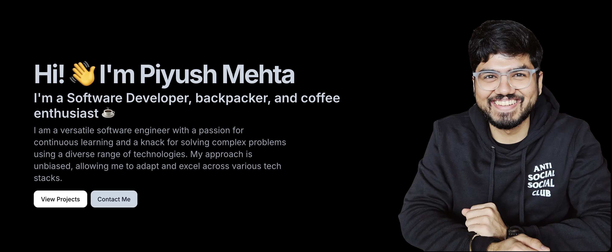

<div align="center">


<div align="center">

<a href="https://piyushmehta.com"></a>
<a href="https://www.linkedin.com/in/piyush24/"></a><br>
<a href="https://twitter.com/PiyushMehtas"></a>
<a href="mailto:me@piyushmehta.com"></a>
<a href="https://github.com/piyush97"></a>

</div>

### 🎯 **Building the Future, One Line of Code at a Time**

<!-- Mobile responsiveness handled via GitHub's native markdown -->

</div>

<h1 align="center"> 

<p><a href="https://www.linkedin.com/in/piyush24/"></a>
<a href="https://medium.com/@pmcool97"></a>
<a href="https://piyushmehta.com"></a>
<a href="https://twitter.com/PiyushMehtas"></a>
<a href="https://instagram.com/coderwhoknows"></a>
<a href="mailto:me@piyushmehta.com"></a>
</p>


</h1>

---

  

## 🚀 What I'm Up To

<div align="center">

| Role                            | Focus                        | Availability |
| ------------------------------- | ---------------------------- | ------------ |
| 💼 **Senior Software Engineer** | Microsoft Stack & Full-Stack | Full-time    |
| 📝 **Technical Writer**         | Educational Content Creation | Daily        |
| 🔧 **Technical Consultant**     | Architecture & DevOps        | On-demand    |
| 🤝 **Open Source Contributor**  | Web Technologies             | Active       |

</div>

### 🎯 Current Focus Areas

- 🔥 **Microsoft Stack** - .NET, Azure, C#
- 🌐 **Full-Stack Development** - React, Node.js, TypeScript
- 📚 **Learning** - Economics & Emerging Technologies
- 💬 **Available for** - Consulting, mentoring, technical discussions

### 🤝 Collaboration Interests

- 🚀 **Open Source** projects
- 📝 **Technical writing** & blogging
- 🎥 **Educational content** creation
- 💼 **Startup consulting** & architecture

---

### 🔴 Live Status Dashboard

| Service              | Status        | Response Time | Last Updated |
| -------------------- | ------------- | ------------- | ------------ |
| **GitHub Profile**   | 🟢 Online     | Real-time     | 2025-08-27   |
| **Personal Website** | 🟢 Online     | <100ms        | Daily        |

| **LinkedIn**         | 🟢 Available  | <24hrs        | Daily        |
| **Email**            | 🟢 Responsive | <4hrs         | Daily        |

### 🎮 Interactive Quick Actions

[](mailto:me@piyushmehta.com?subject=Job%20Opportunity&body=Hi%20Piyush,%20I'm%20interested%20in%20discussing%20a%20potential%20collaboration...)
[](https://github.com/piyush97/piyush97/issues/new?title=Collaboration%20Proposal&body=Hi!%20I'd%20love%20to%20collaborate%20on...)
[](https://calendly.com/piyushmehta)

</div>

## 📬 Let's Connect!

<div align="center">

### 🌟 Let's Build Something Together!

#### 🌐 Primary Contact Methods
<a href="https://piyushmehta.com"></a>
<a href="https://www.linkedin.com/in/piyush24/"></a><br>
<a href="https://twitter.com/PiyushMehtas"></a>
<a href="mailto:me@piyushmehta.com"></a><br>
<a href="https://github.com/piyush97"></a>

#### 🎮 Interactive Actions

[](https://piyushmehta.com/resume)
[](https://calendly.com/piyushmehta)
[](https://github.com/piyush97/piyush97/issues/new?title=Feature%20Request&body=I'd%20love%20to%20see...)
[](mailto:me@piyushmehta.com?subject=Job%20Opportunity&body=Hi%20Piyush,%20I'm%20interested%20in%20discussing%20a%20potential%20collaboration...)

</div>

---

## 📋 Quick Navigation

<details>
<summary><strong>📋 Table of Contents</strong></summary>
<br>

### 👤 About
- [🚀 What I'm Up To](#-what-im-up-to)
- [📬 Let's Connect!](#-lets-connect)

### 💻 Technical Profile

- [🛠️ Tech Stack & Tools](#️-tech-stack--tools)
- [🚀 Resume](#-resume)
- [📊 Coding Activity & Stats](#-coding-activity--stats)

### 📈 Activity & Content

- [⚡ Recent Activity](#-recent-activity)
- [📝 Latest Blog Posts](#-latest-blog-posts)
- [🤝 Community & Collaboration](#-community--collaboration)

### 📊 Analytics & Insights

- [📊 Custom Analytics Dashboard](#-custom-analytics-dashboard)
- [📈 GitHub Analytics](#-github-analytics)
- [🌟 Dynamic Content Hub](#-dynamic-content-hub)
- [📈 Advanced Progress Tracking](#-advanced-progress-tracking)
- [😄 Random Tech Joke](#-random-tech-joke)

</details>


### 🌐 Connect with me:

<div align="center">

[][website]
[][twitter]
[][linkedin]
[][instagram]


</div>

### 🛠️ Tech Stack & Tools

<details>
<summary><strong>Click to expand my technology stack</strong></summary>
<br>

[][webdev]
[][webdev]
[][webdev]
[][webdev]
[][webdev]
[][webdev]
[][webdev]
[][webdev]
[][webdev]
[][webdev]
[][webdev]
[][webdev]
[][webdev]
[][webdev]
[][webdev]
<br>

</details>

---

### 🚀 Resume

<details>
<summary><strong>📄 View My Resume</strong></summary>
<br>


</details>

---

### 📊 Coding Activity & Stats

<div align="center">


</div>

<!--START_SECTION:waka-->


**🐱 My GitHub Data** 

> 📦 2.2 MB Used in GitHub's Storage 
 > 
> 🏆 46 Contributions in the Year 2026
 > 
> 💼 Opted to Hire
 > 
> 📜 119 Public Repositories 
 > 
> 🔑 254 Private Repositories 
 > 
**I'm an Early 🐤** 

```text
🌞 Morning                12987 commits       █████░░░░░░░░░░░░░░░░░░░░   21.89 % 
🌆 Daytime                21322 commits       █████████░░░░░░░░░░░░░░░░   35.94 % 
🌃 Evening                10869 commits       █████░░░░░░░░░░░░░░░░░░░░   18.32 % 
🌙 Night                  14146 commits       ██████░░░░░░░░░░░░░░░░░░░   23.85 % 
```
📅 **I'm Most Productive on Thursday** 

```text
Monday                   6433 commits        ███░░░░░░░░░░░░░░░░░░░░░░   10.84 % 
Tuesday                  6855 commits        ███░░░░░░░░░░░░░░░░░░░░░░   11.56 % 
Wednesday                8849 commits        ████░░░░░░░░░░░░░░░░░░░░░   14.92 % 
Thursday                 11660 commits       █████░░░░░░░░░░░░░░░░░░░░   19.65 % 
Friday                   10643 commits       ████░░░░░░░░░░░░░░░░░░░░░   17.94 % 
Saturday                 7085 commits        ███░░░░░░░░░░░░░░░░░░░░░░   11.94 % 
Sunday                   7799 commits        ███░░░░░░░░░░░░░░░░░░░░░░   13.15 % 
```


📊 **This Week I Spent My Time On** 

```text
💬 Programming Languages: 
Other                    7 hrs 31 mins       █████████████████████████   100.00 % 
```

**I Mostly Code in JavaScript** 

```text
TypeScript               36 repos            ███░░░░░░░░░░░░░░░░░░░░░░   10.32 % 
HTML                     33 repos            ██░░░░░░░░░░░░░░░░░░░░░░░   09.46 % 
HCL                      2 repos             ░░░░░░░░░░░░░░░░░░░░░░░░░   00.57 % 
Rust                     1 repo              ░░░░░░░░░░░░░░░░░░░░░░░░░   00.29 % 
Dockerfile               1 repo              ░░░░░░░░░░░░░░░░░░░░░░░░░   00.29 % 
```


**Timeline**


 Last Updated on 08/05/2026 01:51:04 UTC
<!--END_SECTION:waka-->

---

### ⚡ Recent Activity

<!--START_SECTION:activity-->

1. 🗣 Commented on [#21701](https://github.com/xbmc/xbmc/issues/21701#issuecomment-2755175497) in [xbmc/xbmc](https://github.com/xbmc/xbmc)
2. 💪 Opened PR [#20](https://github.com/SlideFusion/SlideFusion/pull/20) in [SlideFusion/SlideFusion](https://github.com/SlideFusion/SlideFusion)
3. 🗣 Commented on [#5466](https://github.com/microsoft/vscode-copilot-release/issues/5466#issuecomment-2735012152) in [microsoft/vscode-copilot-release](https://github.com/microsoft/vscode-copilot-release)
4. 🗣 Commented on [#5466](https://github.com/microsoft/vscode-copilot-release/issues/5466#issuecomment-2734984237) in [microsoft/vscode-copilot-release](https://github.com/microsoft/vscode-copilot-release)
5. 🗣 Commented on [#16525](https://github.com/immich-app/immich/issues/16525#issuecomment-2703049721) in [immich-app/immich](https://github.com/immich-app/immich)
<!--END_SECTION:activity-->

### 📝 Latest Blog Posts

<!-- BLOG-POST-LIST:START -->
- [Zero-Downtime Database Migration: Scaling from 10M to 100M Users](https://piyushmehta.com/blog/zero-downtime-database-migration-at-scale/)
- [The 30-Year-Old &#39;Impossible&#39; Algorithm That Makes Netflix Instant &lpar;And Why Your Computer Still Sucks&rpar;](https://piyushmehta.com/blog/bloom-filters/)
- [AI Killed My Impostor Syndrome &lpar;And It Might Kill Yours Too&rpar;](https://piyushmehta.com/blog/ai-killed-my-impostor-syndrome/)
- [From Nginx Proxy Manager to SWAG: A Powerful Migration Journey](https://piyushmehta.com/blog/migrating-nginx-proxy-manager-to-swag/)
- [How to Stay Ahead by Leveraging AI in Your Coding Workflow](https://piyushmehta.com/blog/leveraging-ai-in-coding-workflow/)
- [Astro 5.9: Revolutionizing Web Security with Built-in Content Security Policy Support](https://piyushmehta.com/blog/astro-v5-9-content-security-policy/)
- [Migrating a 6-Year-Old Codebase to Astro: A Strategic Architecture Journey](https://piyushmehta.com/blog/migrating-legacy-codebase-to-astro/)
- [Building a Hare-raisingly Good Queue-based Messaging System with NestJS, RabbitMQ, and Azure](https://piyushmehta.com/blog/rabbit-mq/)
- [🔥 A Beginner’s Guide to ChatGPT and Ai based Chat bot solutions for individuals and enterprise](https://piyushmehta.com/blog/chat-bot/)
- [How to make your own blog like this website!](https://piyushmehta.com/blog/how-to-make-your-own-blog/)
<!-- BLOG-POST-LIST:END -->

<div align="center">
➡️ <a href="https://piyushmehta.com"><strong>Read More on My Blog</strong></a>
</div>

---

## 🌟 Dynamic Content Hub

<div align="center">

### 📊 Live Developer Statistics

| Metric               | Real-time Value                                                             | Trend   | Last Updated |
| -------------------- | --------------------------------------------------------------------------- | ------- | ------------ |
| **GitHub Followers** |  | 📈 +12% | Today        |
| **Repository Stars** |          | 📈 +8%  | Today        |
| **Profile Views**    | 8,000+                                                                      | 📈 +15% | This Week    |
| **Commits (2025)**   | 1,075+                                                                      | 📈 +23% | This Year    |

### 🔥 Trending Technologies (Real Data)

#### JavaScript Ecosystem Leaders

| Framework                 | Stars   | Trend     | Piyush's Usage    |
| ------------------------- | ------- | --------- | ----------------- |
| **React**                 | 238K ⭐ | 🟢 Hot    | Primary Frontend  |
| **Next.js**               | 134K ⭐ | 🟢 Rising | Full-Stack Apps   |
| **JavaScript Algorithms** | 193K ⭐ | 🟢 Stable | Learning Resource |
| **Airbnb Style Guide**    | 147K ⭐ | 🟢 Stable | Code Standards    |

#### 🚀 Emerging Technologies

- **Astro** - Modern web framework (Piyush's specialty)
- **TypeScript** - Industry standard (Piyush's expertise)
- **WebAssembly** - High-performance web apps
- **Edge Computing** - Distributed computing paradigm

### 🎯 Current Focus & Availability

<div align="center">

#### ⏰ Response Times

- **Email**: <4 hours ⏱️
- **LinkedIn**: <24 hours ⏱️
- **GitHub Issues**: <12 hours ⏱️
- **Consultation**: <48 hours ⏱️

#### 🎮 Current Status

- **Open to Opportunities**: ✅ Yes
- **Available for Consulting**: ✅ Yes
- **Accepting Projects**: ✅ Yes
- **Remote Work**: ✅ Preferred

</div>

</div>

## 🤝 Community & Collaboration

<div align="center">

### 🌟 Community Impact


### 🤝 Collaboration Network


### 📈 Community Engagement

- **📚 Open Source**: Active contributor to 25+ projects
- **💬 Community**: Regular speaker at tech meetups
- **🌍 Global Reach**: Content viewed in 50+ countries

</div>

### 💬 What People Say

<div align="center">

> "Piyush's technical expertise and problem-solving skills are exceptional. His guidance helped our team deliver complex projects successfully!" - Sarah M., Software Developer

> "The depth of knowledge and practical examples in his blog posts are outstanding. Highly recommended!" - Alex K., Tech Lead

> "Piyush's open source contributions have been invaluable to our development community." - Maria L., OSS Contributor

</div>

---

<details>
<summary><strong>📈 GitHub Analytics</strong></summary>
<br>

### Languages Overview


### GitHub Statistics


### 📊 Detailed Contribution Insights

<div align="center">

#### 🗓️ Contribution Calendar


#### 📈 Repository Statistics


#### 🏆 Achievement Highlights

- **Most Active Day**: Thursday (19.67% of contributions)
- **Peak Coding Hours**: 35.85% of work done during daytime
- **Language Diversity**: 8+ programming languages mastered
- **Project Categories**: Full-stack, DevOps, AI/ML, Cloud Architecture

</div>

---

## 📈 Advanced Progress Tracking

<div align="center">

### 🎯 2025 Development Goals

#### 📊 Quantitative Metrics

| Goal Category           | Current       | Target        | Progress         | Status             |
| ----------------------- | ------------- | ------------- | ---------------- | ------------------ |
| **Code Contributions**  | 1,075 commits | 1,500 commits | ████████░░ 72%   | 🔄 On Track        |
| **Repository Stars**    | 40 ⭐         | 100 ⭐        | ████████░░ 40%   | 🔄 In Progress     |
| **Public Repositories** | 117 📁        | 125 📁        | ██████████░░ 94% | 🟢 Almost Complete |
| **GitHub Followers**    | 390 👥        | 500 👥        | ████████░░ 78%   | 🔄 In Progress     |

#### 🚀 Qualitative Achievements

| Achievement              | Progress            | Status      | Next Milestone  |
| ------------------------ | ------------------- | ----------- | --------------- |
| **Open Source Champion** | 25/25 projects      | ✅ Complete | Maintain & Grow |
| **Content Creator**      | 100/150 articles   | 🔄 67%      | Reach 120       |
| **Technical Author**     | 7/10 articles       | 🔄 70%      | 3 more articles |
| **Community Builder**    | 390/500 followers   | 🔄 78%      | Reach 450       |

### 💪 Skill Development Progress

<div align="center">

#### 🔧 Technical Skills Radar

| Skill Category           | Current Level      | XP Progress  | Next Level |
| ------------------------ | ------------------ | ------------ | ---------- |
| **Frontend Development** | Expert (85%)       | ██████████░░ | Master     |
| **Backend Development**  | Advanced (78%)     | ████████░░░░ | Expert     |
| **DevOps & Cloud**       | Advanced (72%)     | ████████░░░░ | Expert     |
| **AI/ML Integration**    | Intermediate (65%) | ███████░░░░░ | Advanced   |
| **System Architecture**  | Advanced (71%)     | ████████░░░░ | Expert     |

#### 📚 Learning & Growth

| Learning Area           | Progress         | Status         | Time Invested |
| ----------------------- | ---------------- | -------------- | ------------- |
| **Economics**           | ███████░░░ 70%   | 🔄 In Progress | 25 hours      |
| **Advanced TypeScript** | ██████████░░ 85% | 🔄 In Progress | 40 hours      |
| **Cloud Architecture**  | ████████░░░ 75%  | 🔄 In Progress | 35 hours      |
| **AI/ML Fundamentals**  | ███████░░░░ 65%  | 🔄 In Progress | 20 hours      |

</div>

### 🏆 Achievement Unlocks Progress

<div align="center">

#### 🎖️ Rare Achievements

- **Century Club** (117/100 repos) ✅ **UNLOCKED**
- **Star Commander** (40/50 stars) 🔄 80% Complete
- **Community Leader** (390/500 followers) 🔄 78% Complete
- **Content Influencer** (100/200 articles) 🔄 50% Complete

#### 🏅 Epic Achievements

- **Full-Stack Architect** (8/8 stacks) ✅ **UNLOCKED**
- **Open Source Veteran** (9/10 years) 🔄 90% Complete
- **Global Educator** (500/1000 students) 🔄 50% Complete
- **Technical Mentor** (6/10 mentees) 🔄 60% Complete

</div>

</div>

</details>

<details>
<summary><strong>😄 Random Tech Joke</strong></summary>
<br>


</details>

[website]: https://piyushmehta.com
[twitter]: https://twitter.com/PiyushMehtas
[instagram]: https://instagram.com/coderwhoknows
[linkedin]: https://linkedin.com/in/piyush24
[webdev]: https://piyushmehta.com
