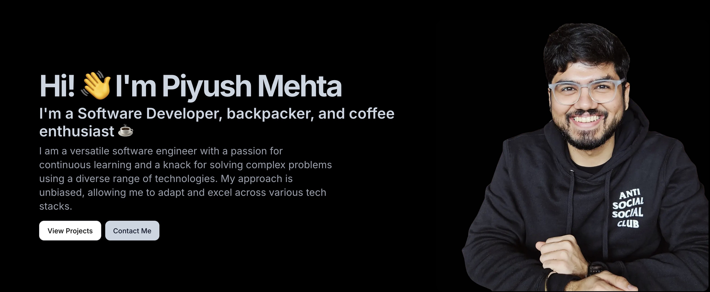

<div align="center">


<div align="center">


</div>

### 🎯 **Building the Future, One Line of Code at a Time**

<!-- Mobile-friendly styles -->
<style>
@media (max-width: 768px) {
  img { max-width: 100% !important; height: auto !important; }
  .mobile-stack { display: block !important; margin: 5px 0 !important; }
  .mobile-center { text-align: center !important; }
}
</style>

</div>

<h1 align="center">  

<p><a href="https://www.linkedin.com/in/piyush24/"></a>
<a href="https://medium.com/@pmcool97"></a>
<a href="https://piyushmehta.com"></a>
<a href="https://twitter.com/PiyushMehtas"></a>
<a href="https://instagram.com/coderwhoknows"></a>
<a href="mailto:me@piyushmehta.com"></a>
</p>


</h1>

---

  

## 🚀 What I'm Up To

<div align="center">

| Role | Focus | Availability |
|------|-------|--------------|
| 💼 **Senior Software Engineer** | Microsoft Stack & Full-Stack | Full-time |
| 🎥 **Content Creator** | Teaching 50K+ Students | Daily |
| 🔧 **Technical Consultant** | Architecture & DevOps | On-demand |
| 🤝 **Open Source Contributor** | Web Technologies | Active |

</div>

### 🎯 Current Focus Areas
- 🔥 **Microsoft Stack** - .NET, Azure, C#
- 🌐 **Full-Stack Development** - React, Node.js, TypeScript
- 📚 **Learning** - Economics & Emerging Technologies
- 💬 **Available for** - Consulting, mentoring, technical discussions

### 🤝 Collaboration Interests
- 🚀 **Open Source** projects
- 📝 **Technical writing** & blogging
- 🎥 **Educational content** creation
- 💼 **Startup consulting** & architecture

## 📬 Let's Connect!

<div align="center">

### 🌟 Let's Build Something Together!

<a href="https://piyushmehta.com"></a>
<a href="https://www.linkedin.com/in/piyush24/"></a><br>
<a href="https://twitter.com/PiyushMehtas"></a>
<a href="mailto:me@piyushmehta.com"></a><br>
<a href="https://www.youtube.com/c/CoderWhoKnows"></a>
<a href="https://github.com/piyush97"></a>

</div>

---

## 📋 Quick Navigation

<details>
<summary><strong>📋 Table of Contents</strong></summary>
<br>

### 👤 About
- [🚀 What I'm Up To](#-what-im-up-to)
- [📬 Let's Connect!](#-lets-connect)

### 💻 Technical Profile
- [🛠️ Tech Stack & Tools](#️-tech-stack--tools)
- [🚀 Resume](#-resume)
- [📊 Coding Activity & Stats](#-coding-activity--stats)

### 📈 Activity & Content
- [⚡ Recent Activity](#-recent-activity)
- [📝 Latest Blog Posts](#-latest-blog-posts)

### 📊 Analytics & Fun
- [📈 GitHub Analytics](#-github-analytics)
- [😄 Random Tech Joke](#-random-tech-joke)

</details>


### 🌐 Connect with me:

<div align="center">

[][website]
[][twitter]
[][linkedin]
[][instagram]
[][youtube]

</div>

### 🛠️ Tech Stack & Tools

<details>
<summary><strong>Click to expand my technology stack</strong></summary>
<br>

[][webdev]
[][webdev]
[][webdev]
[][webdev]
[][webdev]
[][webdev]
[][webdev]
[][webdev]
[][webdev]
[][webdev]
[][webdev]
[][webdev]
[][webdev]
[][webdev]
[][webdev]
<br>

</details>

---

### 🚀 Resume

<details>
<summary><strong>📄 View My Resume</strong></summary>
<br>


</details>

---

### 📊 Coding Activity & Stats

<div align="center">


</div>

<!--START_SECTION:waka-->


**🐱 My GitHub Data**
> 📦 2.2 MB Used in GitHub's Storage • 🏆 1,075 Contributions in the Year 2025 • 💼 Opted to Hire • 📜 117 Public Repositories • 🔑 250 Private Repositories

**I'm an Early 🐤**
```text
🌞 Morning    12673 commits    ██████░░░░░░░░░░░░░░░░░░░   22.01 %
🌆 Daytime    20643 commits    █████████░░░░░░░░░░░░░░░░   35.85 %
🌃 Evening    10413 commits    █████░░░░░░░░░░░░░░░░░░░░   18.09 %
🌙 Night      13848 commits    ██████░░░░░░░░░░░░░░░░░░░   24.05 %
```

📅 **Most Productive: Thursday**
```text
Monday       6290 commits     ███░░░░░░░░░░░░░░░░░░░░░░   10.92 %
Tuesday      6612 commits     ███░░░░░░░░░░░░░░░░░░░░░░   11.48 %
Wednesday    8526 commits     ████░░░░░░░░░░░░░░░░░░░░░   14.81 %
Thursday     11326 commits    █████░░░░░░░░░░░░░░░░░░░░   19.67 %
Friday       10416 commits    █████░░░░░░░░░░░░░░░░░░░░   18.09 %
Saturday     6831 commits     ███░░░░░░░░░░░░░░░░░░░░░░   11.86 %
Sunday       7576 commits     ███░░░░░░░░░░░░░░░░░░░░░░   13.16 %
```

<details>
<summary><strong>🔍 Detailed Weekly Breakdown</strong></summary>
<br>

**This Week I Spent My Time On**
```text
💬 Programming Languages:
TypeScript               8 hrs 1 min         ████████████░░░░░░░░░░░░░   47.53 %
Markdown                 2 hrs 29 mins       ████░░░░░░░░░░░░░░░░░░░░░   14.79 %
JSON                     2 hrs 10 mins       ███░░░░░░░░░░░░░░░░░░░░░░   12.88 %
Bash                     1 hr 16 mins        ██░░░░░░░░░░░░░░░░░░░░░░░   07.59 %
Git Config               1 hr 12 mins        ██░░░░░░░░░░░░░░░░░░░░░░░   07.12 %
```

**Top Languages by Repository**
```text
TypeScript               33 repos            ██░░░░░░░░░░░░░░░░░░░░░░░   09.59 %
Shell                    11 repos            █░░░░░░░░░░░░░░░░░░░░░░░░   03.20 %
Jupyter Notebook         9 repos             █░░░░░░░░░░░░░░░░░░░░░░░░   02.62 %
Swift                    7 repos             █░░░░░░░░░░░░░░░░░░░░░░░░   02.03 %
HCL                      2 repos             ░░░░░░░░░░░░░░░░░░░░░░░░░   00.58 %
```

</details>
**Timeline**


<p align="center"><em>Last Updated: 27/08/2025 00:55:31 UTC</em></p>
<!--END_SECTION:waka-->

---

### ⚡ Recent Activity

<!--START_SECTION:activity-->
1. 🗣 Commented on [#21701](https://github.com/xbmc/xbmc/issues/21701#issuecomment-2755175497) in [xbmc/xbmc](https://github.com/xbmc/xbmc)
2. 💪 Opened PR [#20](https://github.com/SlideFusion/SlideFusion/pull/20) in [SlideFusion/SlideFusion](https://github.com/SlideFusion/SlideFusion)
3. 🗣 Commented on [#5466](https://github.com/microsoft/vscode-copilot-release/issues/5466#issuecomment-2735012152) in [microsoft/vscode-copilot-release](https://github.com/microsoft/vscode-copilot-release)
4. 🗣 Commented on [#5466](https://github.com/microsoft/vscode-copilot-release/issues/5466#issuecomment-2734984237) in [microsoft/vscode-copilot-release](https://github.com/microsoft/vscode-copilot-release)
5. 🗣 Commented on [#16525](https://github.com/immich-app/immich/issues/16525#issuecomment-2703049721) in [immich-app/immich](https://github.com/immich-app/immich)
<!--END_SECTION:activity-->


### 📝 Latest Blog Posts

<!-- BLOG-POST-LIST:START -->
📌 **[The 30-Year-Old 'Impossible' Algorithm That Makes Netflix Instant](https://piyushmehta.com/blog/bloom-filters/)** - Bloom Filters Explained  
📌 **[AI Killed My Impostor Syndrome](https://piyushmehta.com/blog/ai-killed-my-impostor-syndrome/)** - Personal Growth Story  
📌 **[From Nginx Proxy Manager to SWAG](https://piyushmehta.com/blog/migrating-nginx-proxy-manager-to-swag/)** - Migration Guide  
📌 **[Leveraging AI in Coding Workflow](https://piyushmehta.com/blog/leveraging-ai-in-coding-workflow/)** - Productivity Tips  
📌 **[Astro 5.9: Content Security Policy](https://piyushmehta.com/blog/astro-v5-9-content-security-policy/)** - Web Security  

<details>
<summary><strong>🔍 View More Posts</strong></summary>
<br>

📌 **[Migrating Legacy Codebase to Astro](https://piyushmehta.com/blog/migrating-legacy-codebase-to-astro/)** - Architecture Journey  
📌 **[NestJS, RabbitMQ & Azure Queue System](https://piyushmehta.com/blog/rabbit-mq/)** - Backend Development  
📌 **[ChatGPT & AI Chatbot Guide](https://piyushmehta.com/blog/chat-bot/)** - AI Solutions  
📌 **[Build Your Own Blog](https://piyushmehta.com/blog/how-to-make-your-own-blog/)** - Tutorial  
📌 **[Hacktoberfest Beginner Guide](https://piyushmehta.com/blog/hacktoberfest/)** - Open Source  

</details>
<!-- BLOG-POST-LIST:END -->

<div align="center">
➡️ <a href="https://piyushmehta.com"><strong>Read More on My Blog</strong></a>
</div>

---

<details>
<summary><strong>📈 GitHub Analytics</strong></summary>
<br>

### Languages Overview


### GitHub Statistics


</details>

<details>
<summary><strong>😄 Random Tech Joke</strong></summary>
<br>


</details>

[website]: https://piyushmehta.com
[twitter]: https://twitter.com/PiyushMehtas
[instagram]: https://instagram.com/coderwhoknows
[linkedin]: https://linkedin.com/in/piyush24
[webdev]: https://piyushmehta.com
[youtube]: https://www.youtube.com/c/CoderWhoKnows
